# AI-Powered Personalized Learning Assistant with Task Management and Reviewer Generator for ACLC College of Sta. Maria

A thesis project presented to the faculty of Computer Science at ACLC College of Santa Maria, Bulacan, in partial fulfillment of the requirements for the Degree of Bachelor of Science in Computer Science.

**Authors:**
* Esteban, Marc Jeillord DC.
* Moreno, Genaro
* Ornopia, Ranz Andrei B.

---

## About The Project

This project is an AI-Powered Personalized Learning Assistant developed to enhance the academic experience at ACLC College of Sta. Maria. It aims to provide a personalized approach to task management and review generation, assisting both students and educators in efficiently managing academic tasks and improving learning outcomes through automated support.

The system was evaluated based on functionality, reliability, usability, efficiency, maintainability, and portability, achieving an overall rating of **4.78 - Highly Acceptable**.

## Screenshots

| Student Login & Dashboard | Student Analytics |
| :---: | :---: |
|  |  |

| Task Manager | Subject Dashboard |
| :---: | :---: |
|  |  |

| AI Reviewer Generator | AI Flashcard Generator |
| :---: | :---: |
| 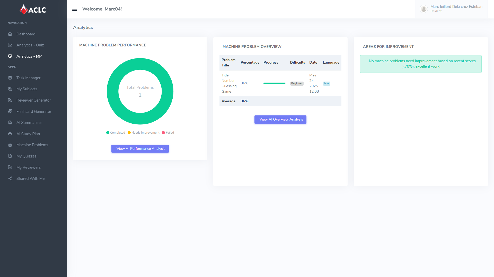 | 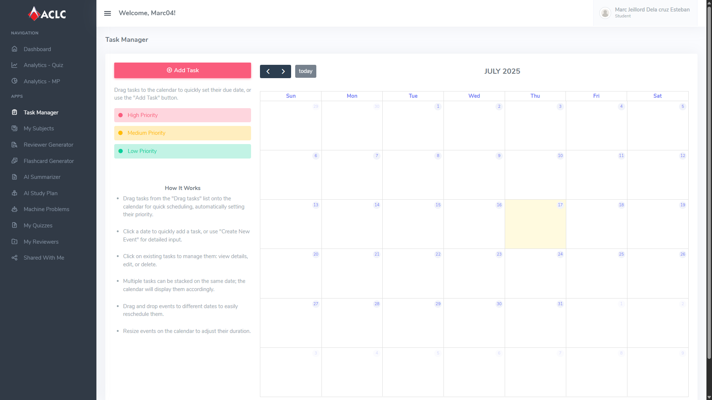 |

| AI Summarizer | AI Study Plan |
| :---: | :---: |
| 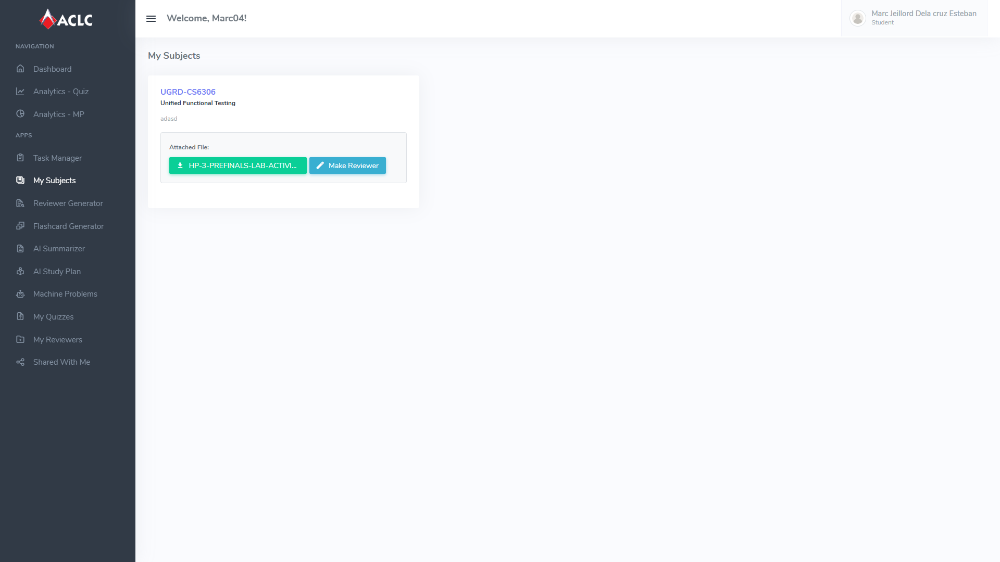 | 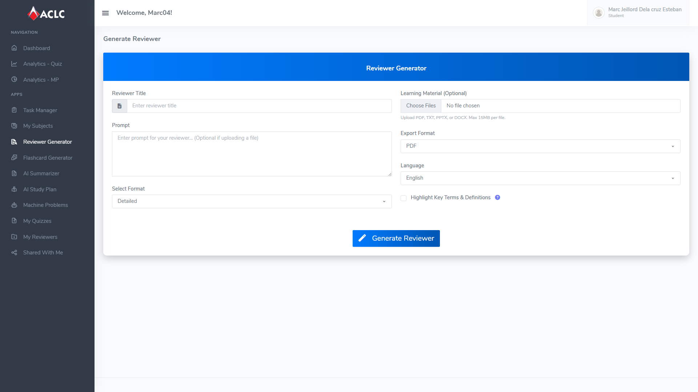 |

| Machine Problems (IT) | Quizzes Page |
| :---: | :---: |
| 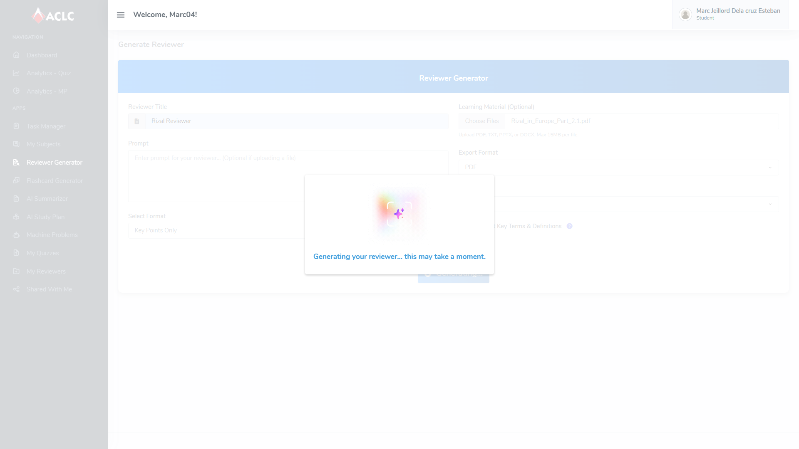 | 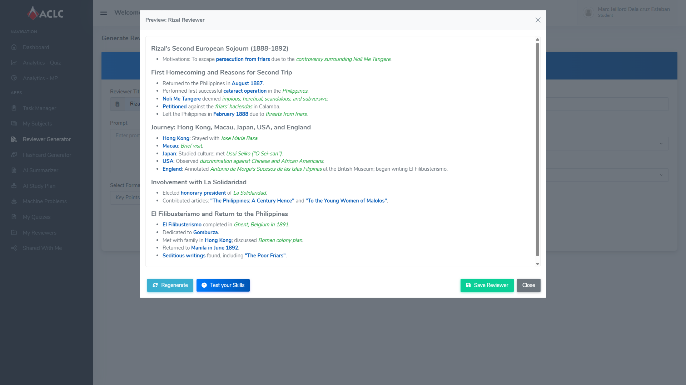 |

| Generated Reviewers | Shared Files |
| :---: | :---: |
| 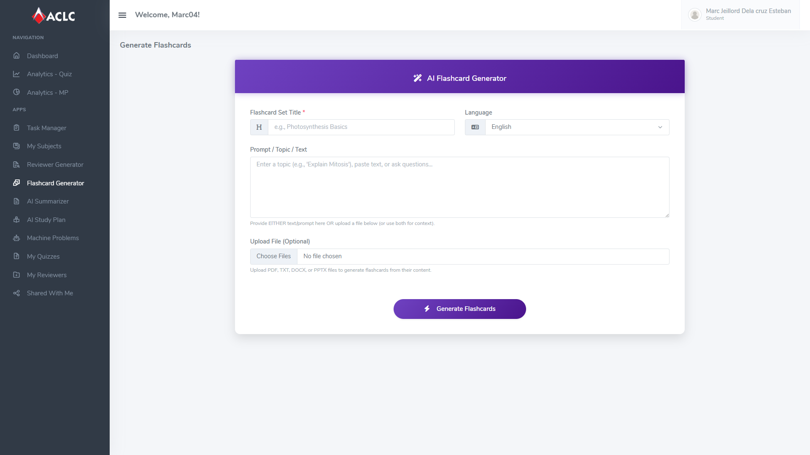 | 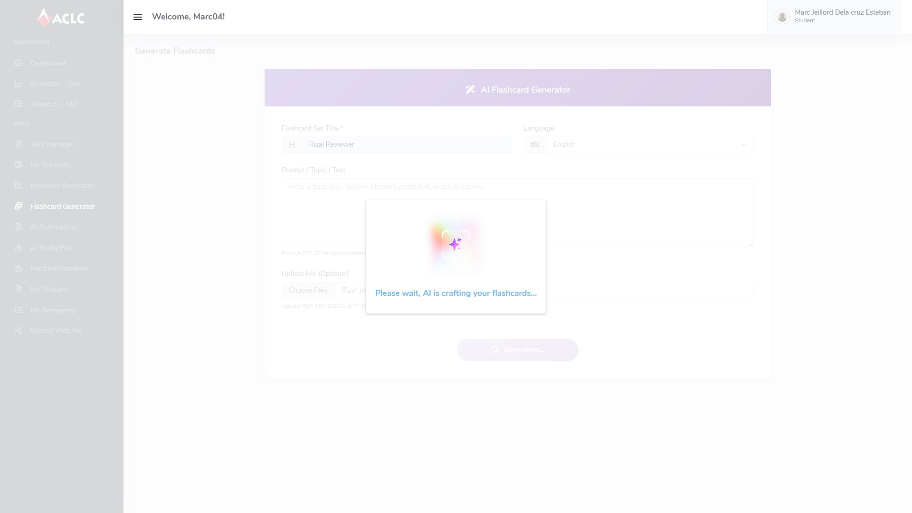 |

| Student Profile | Teacher Dashboard |
| :---: | :---: |
| 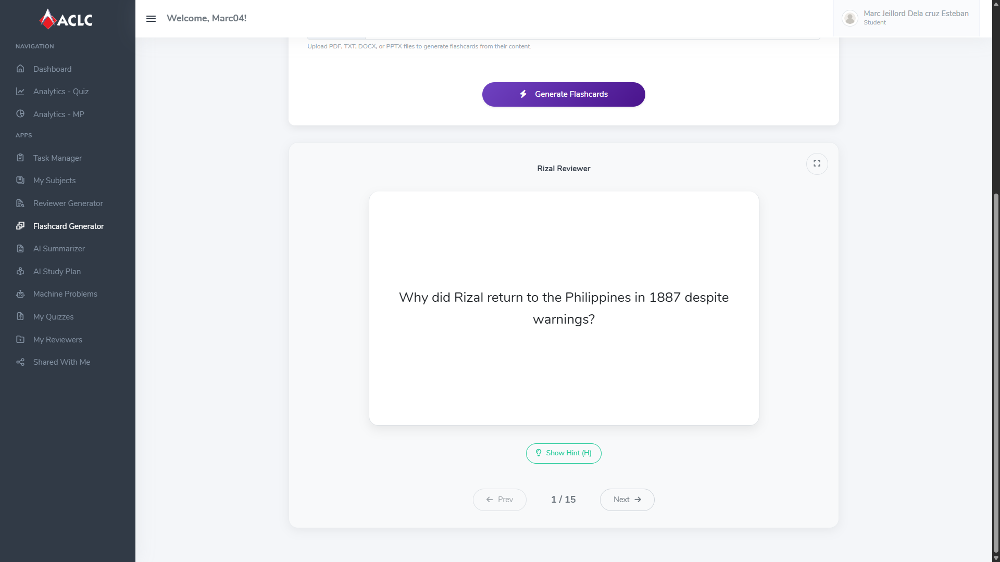 | 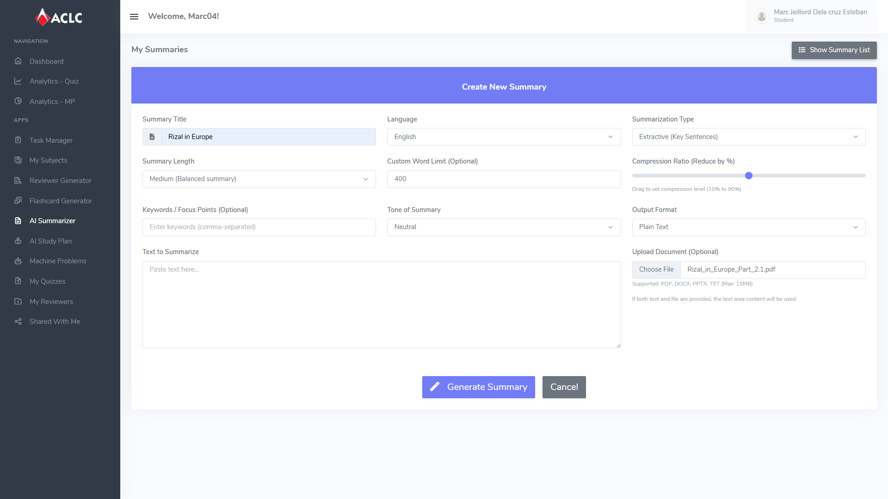 |

| Teacher Analytics | Teacher AI Quiz Generator |
| :---: | :---: |
| 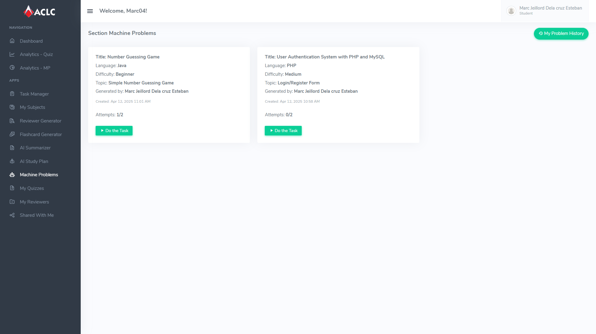 | 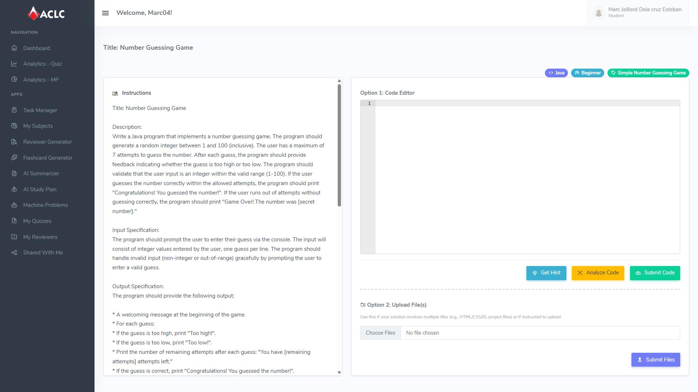 |

| Teacher AI Exam Generator | Teacher AI Machine Problem Generator |
| :---: | :---: |
| 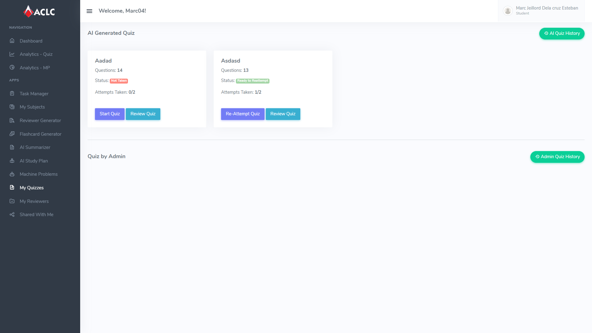 | 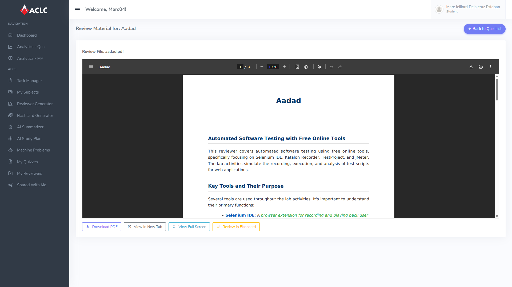 |

| Teacher Student Manager | Teacher Course Manager |
| :---: | :---: |
| 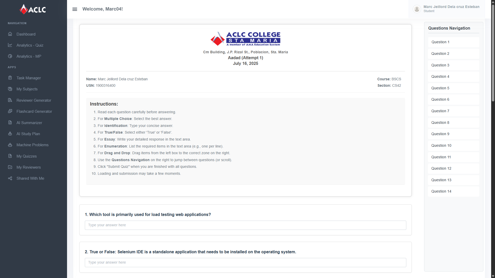 | 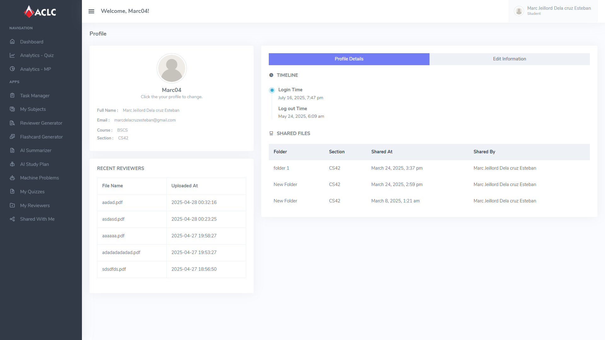 |

### Built With

This project was developed using the following technologies:

* PHP
* MySQL
* JavaScript
* HTML & CSS
* Google Gemini AI

### Methodology

The project was developed using a **Hybrid Agile-Waterfall** model. This approach combined the structured planning of the Waterfall model for initial requirements and design with the flexibility and iterative nature of Agile for the development and testing phases.
