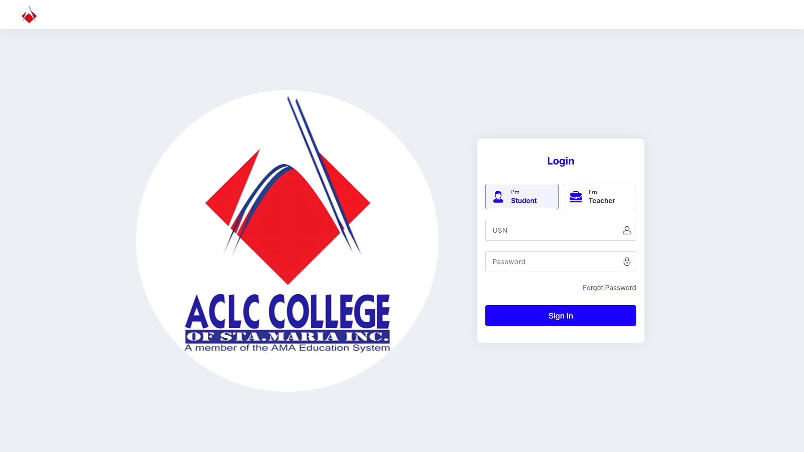
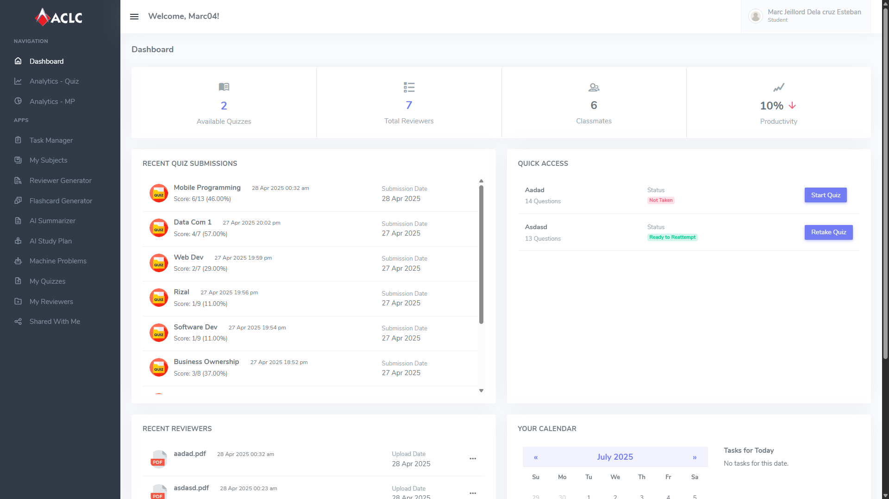
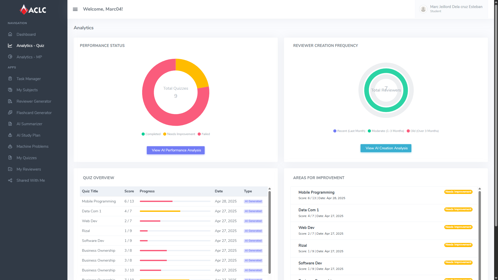

  
# AI-Powered Personalized Learning Assistant
### A Thesis Project for ACLC College of Sta. Maria

-blue)

---

This project is an **AI-Powered Personalized Learning Assistant** developed to enhance the academic experience at ACLC College of Sta. Maria. It provides a modern, personalized approach to task management and review generation, assisting both students and educators in managing academic workloads and improving learning outcomes through automated, intelligent support.

The system was formally evaluated based on ISO 25010 criteria (functionality, reliability, usability, efficiency, maintainability, and portability), achieving an overall rating of **4.78 out of 5.0 - Highly Acceptable**.

## ✨ Key Features

* **📚 AI Reviewer Generator:** Automatically creates comprehensive reviewers from uploaded course materials (PDFs, text).
* **🃏 AI Flashcard Generator:** Instantly generates flashcards to aid in memorization and active recall.
* **✍️ AI Content Summarizer:** Condenses long documents and lectures into key points for efficient studying.
* **📅 Dynamic Task Management:** A smart to-do list and calendar to help students track deadlines for assignments, quizzes, and machine problems.
* **📊 Analytics Dashboard:** Provides students with insights into their performance on quizzes and other activities.
* **📝 Interactive Quizzes & Assessments:** Enables students to take quizzes and submit machine problems directly through the platform.
* **👤 Personalized Student Portal:** A centralized hub for students to access their subjects, tasks, and generated study materials.

## 📸 Screenshots

Click to view project screenshots

| Student Login & Dashboard | Personalized Dashboard |
| :---: | :---: |
|  |  |

| Performance Analytics (Quiz) | Performance Analytics (Machine Problem) |
| :---: | :---: |
|  |  |

| Task Manager | Student Subjects |
| :---: | :---: |
|  |  |

| AI Reviewer Generator | Generated Reviewers |
| :---: | :---: |
|  |  |

| AI Flashcard Generator | Generated Flashcards |
| :---: | :---: |
|  |  |

| My Quizzes | Taking a Quiz |
| :---: | :---: |
|  |  |

## 🛠️ Tech Stack

* **Backend:** PHP
* **Database:** MySQL
* **Frontend:** JavaScript, HTML5, CSS3
* **AI Integration:** Google Gemini API

## 🏗️ Development Methodology

This project was developed using a **Hybrid Agile-Waterfall** model. This approach provided a robust framework by:
1.  **Waterfall:** Utilizing a structured, sequential process for initial requirements gathering, analysis, and system design.
2.  **Agile:** Adopting an iterative and incremental approach during the development, testing, and feedback phases to ensure flexibility and rapid adaptation to challenges.

## 🎓 About the Thesis

This project was presented to the faculty of the Computer Science department at ACLC College of Santa Maria, Bulacan, in partial fulfillment of the requirements for the Degree of Bachelor of Science in Computer Science.

---

## 📞 Project Inquiries & Pricing

For those interested in acquiring this project for academic or commercial use, please feel free to reach out to discuss the details, features, and pricing.

**Contact:** Marc Jeillord DC. Esteban  
**Email:** 📧 <marcdelacruzesteban@gmail.com>
